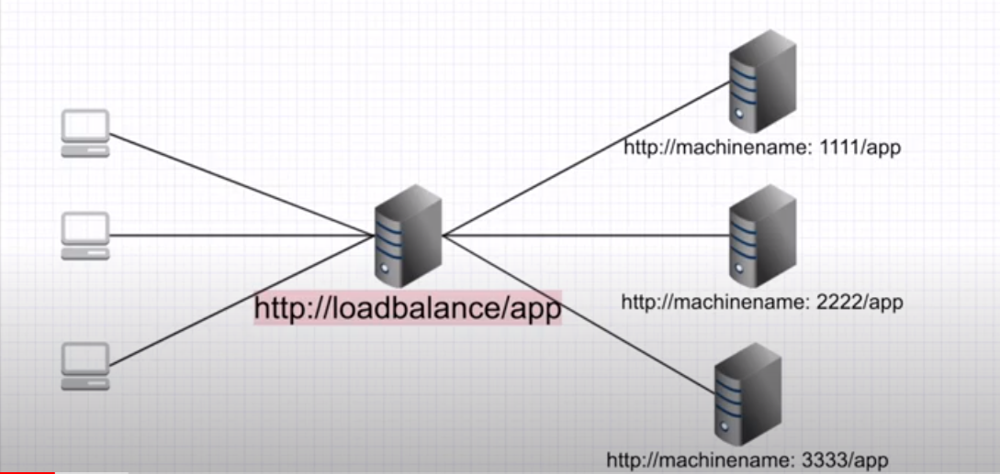

# Practical example of load balancing using Nginx
### Nginx as a reverse proxy



Nginx can function both as a webserver or a proxy.Nginx can be used as a reverse proxy server to serve different clients from different servers.By default , Nginx server listens on port 80 and receives the request from clients and forwards the requests to different servers.Which server to choose is based on round-robin algorithm in Nginx.In our load balancer config file,
```
server {

    listen 80;
    location /tronal_dump/ {
        proxy_pass http://expressweb/;
    }
}
```

we've to create a server which listens on port 80 and say, for example, when gets `/tronal_dump` , it proxy passes the request to `http://expressweb/`.To define `expressweb` we create an upstream service and mention our servers.
```
upstream expressweb {

    server localhost:1111;
    server localhost:2222;
    server localhost:3333;

}
```
These two portions conplete the config file for load balancing and then including it in the `nginx.conf` will do the work.
 
### How to run
Clone the repo , make sure express JS ,postgresql and Nginx are installed in your machine.

To install Nginx,run
```
sudo apt-get update
sudo apt-get install nginx
```
Then start Nginx server with `sudo systemctl start nginx` and go to `localhost` and you will see a welcome message if everything is fine.Now , you need to customize the Nginx configuration.To do so,first remove default.conf file from `/etc/nginx/sites-enabled/` directory.Open `/etc/nginx/nginx.conf` file and include the custom configuration file,`express.conf`,by adding the following line
```
include /home/<user_name>/Documents/Tonal_Drump/loadbalancer/express.conf;
```
NB : replace the line with the location of express.conf from your machine.Then restart the Nginx server by running `sudo nginx -s reload`.

Execute sql files under `database` directory and make any modifications, if needed, in the database settings of index.js(like database name or changing password).

If things are fine so far , start NodeJS server at several ports with the following 3 commands at three terminal instances.

```
node index.js 1111
node index.js 2222
node index.js 3333
```
This will start 3 servers at 3 different ports.Then visit the web app at 3 different ports (`localhost:port`) and look at the process ids of each.You will see a different process id defined by your OS to all three of the instances.Now open another tab in your browser and go to `localhost:tronal_dump` and see the process id.Reload it and see the process id is changing which means you are served by different servers at different time.


